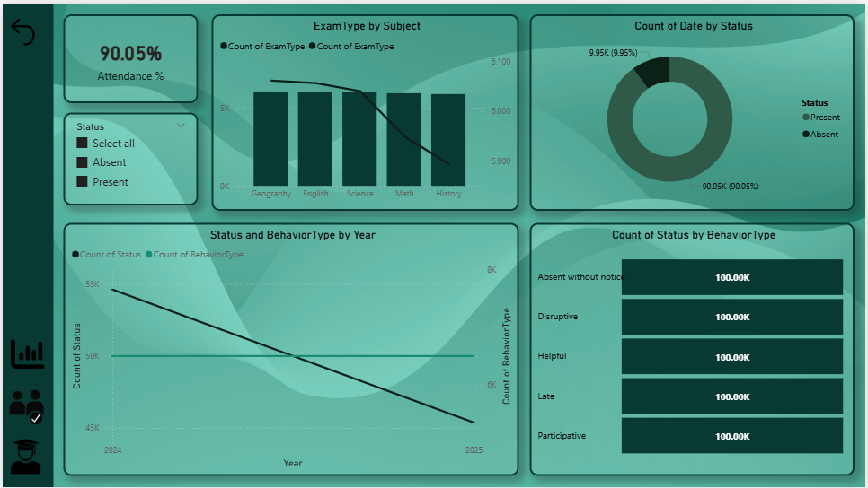
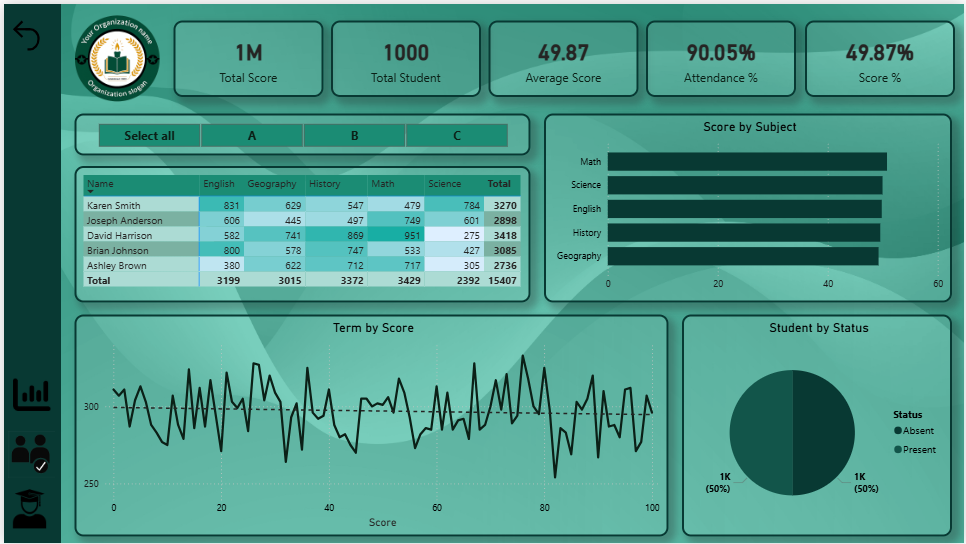
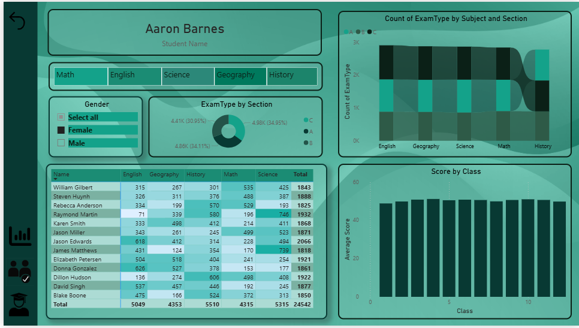

# 📊 Student Performance, Attendance & Behavior Dashboard (Power BI)

## 🧾 Project Overview
This project is an **interactive Power BI dashboard** designed to analyze **student academic performance, attendance, and behavioral patterns**.  
It helps educators and administrators make **data-driven decisions** by providing clear insights at **school, subject, class, and individual student levels**.

---

## 🎯 Objectives
- Track **student attendance percentage**
- Analyze **exam scores by subject**
- Monitor **student behavior types**
- Compare **performance trends across years**
- Enable **student-level drill-down analysis**

---

## 🗂️ Dataset
📁 [Students Dataset](./Data/Students.csv)  
📁 [Scores Dataset](./Data/Scores.csv)  
📁 [Attendance Dataset](./Data/Attendance.csv)  
📁 [Behavior Dataset](./Data/Behavior.csv)

---

## 🗂️ Dataset Used
The project uses the following CSV files:

| File Name | Description |
|---------|-------------|
| `Students.csv` | Student master details |
| `Scores.csv` | Subject-wise exam scores |
| `Attendance.csv` | Attendance records (Present/Absent) |
| `Behavior.csv` | Student behavior categories |

---

## 📌 Key Dashboards & Pages

### 1️⃣ Attendance & Behavior Overview
**Insights included:**
- Overall **Attendance %**
- Attendance by **Status (Present / Absent)**
- **Behavior Type distribution**
- Attendance & behavior **trend by year**
- Exam type analysis by subject

📷 *Dashboard View:*  

---

### 2️⃣ Overall Performance Dashboard
**Insights included:**
- Total Score & Average Score
- Total Students Count
- Attendance % & Score %
- Subject-wise score comparison
- Student status distribution
- Term-wise score trend
- Interactive student table

📷 *Dashboard View:*  

---

### 3️⃣ Student Detail Analysis
**Insights included:**
- Individual student performance
- Subject-wise score breakdown
- Exam type by section
- Gender-based filtering
- Class-wise average score
- Detailed student score table

📷 *Dashboard View:*  

---

## 📊 Key KPIs
- 📈 **Attendance Percentage**
- 🎓 **Average Score**
- 🧮 **Total Score**
- 👩‍🎓 **Total Students**
- 📚 **Subject-wise Performance**
- 🚦 **Behavior Type Count**

---

## 🛠️ Tools & Technologies
- **Power BI Desktop**
- **DAX (Data Analysis Expressions)**
- **Power Query**
- **CSV Data Sources**
- **Data Modeling & Relationships**

---

## 🔍 Features
- Fully **interactive slicers & filters**
- **Drill-through** to student-level details
- Clean & modern **UI design**
- Optimized **data model**
- Dynamic KPIs & measures

---

## 🚀 How to Use
1. Download the repository
2. Open `Practicalexam.pbix` in **Power BI Desktop**
3. Refresh data if needed
4. Interact using slicers and filters

---

## 📌 Use Cases
- School performance monitoring
- Student behavior analysis
- Attendance tracking
- Academic reporting
- Education analytics projects

---

## 🤝 Contribution
Contributions, suggestions, and improvements are welcome.  
Feel free to **fork** the repository and submit a **pull request**.

---

## 👤 Author
**Krisha Anghan**  
📊 Data Analyst | Power BI Developer  

---

## ⭐ If you like this project
Don’t forget to **star ⭐ the repository** and share your feedback!

